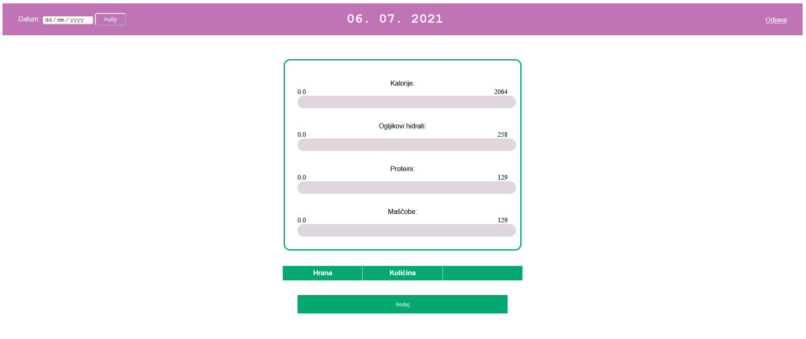
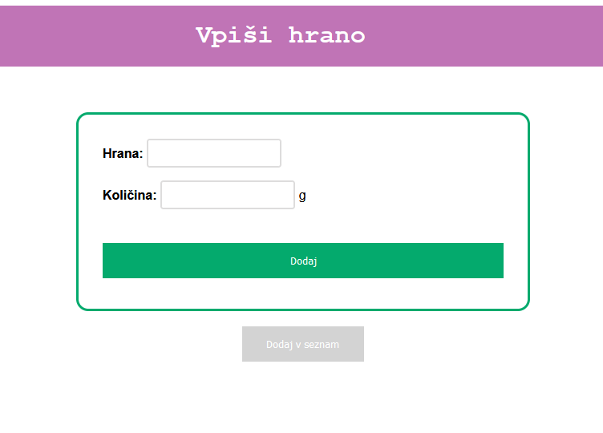
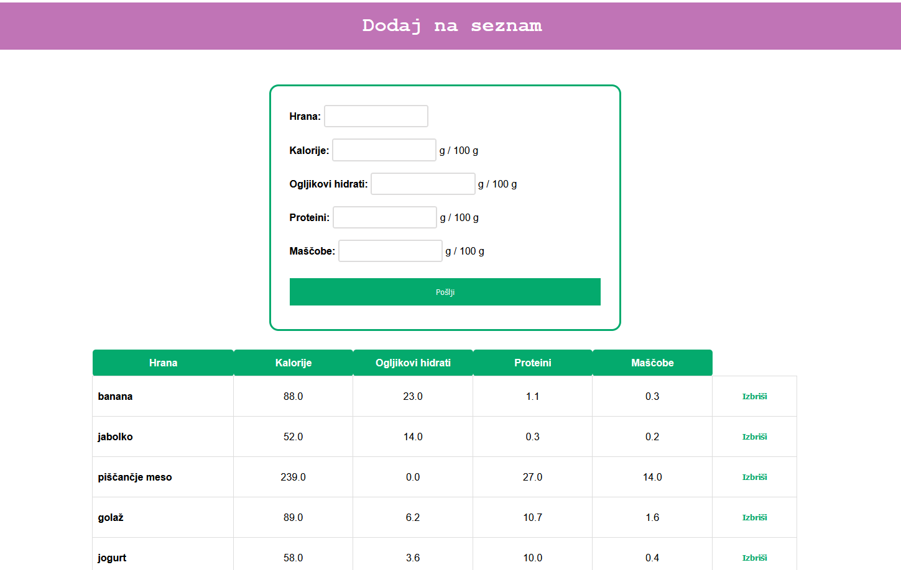
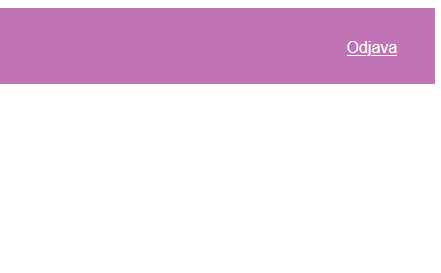

# nutrient-tracker
je program za vodenje evidence dnevno pridobljenih makronutrientov, ki omogoča dolgoročno lokalno shranjevanje.

Program zaženete z datoteko spletni_vmesnik.py.

## Opis programa

Po prijavi smo preusmerjeni na glavno stran. Na vrhu je izpisan izbran datum, ki ga lahko poljubno spremenite.
Na tej strani so izpisane dnevne vnešene vrednosti ter hrana, ki ste jo vpisali. Na dnu strani je gumb za 
dodajanje hrane na izbran dan.

S klikom na gumb ste preusmerjeni na stran za dodajanje hrane. Dodate z vpisom imena hrane in količine v gramih 
ter klikom na gumb. Če program hrane ne prepozna, je verjetno ni med seznamom vse shranjene hrane. 

Tudi na tega lahko dodajate. Vpisujte vrednosti v gramih na 100 gramov navedene hrane. Na dnu je izpisan seznam
vseh shranjenih vrednosti. Če se zmotite, lahko vrstico izbrišete. 

Odjavite se lahko iz katerekoli strani s klikom na zgornji desni gumb.

